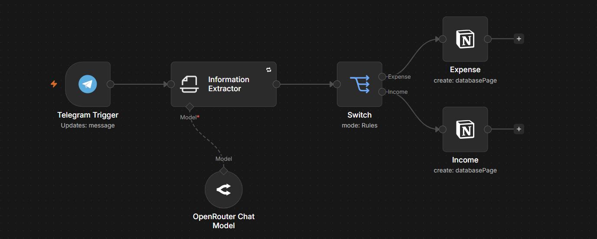

# 💰 Finance Tracker — n8n

An automated personal finance tracker built with **n8n, Telegram, Notion, and AI**.

The idea is simple: instead of manually adding every transaction to a spreadsheet or database, you can just send a message to a Telegram bot. The workflow reads the message, extracts the important details, figures out what type of transaction it is, and saves everything to the right Notion database automatically.

## 🎯 Project Goal

The goal of this project is to make tracking daily finances as quick and natural as possible.

You can send a message in plain language, for example:

```text
دفعت 150 جنيه مواصلات كاش
```

or:

```text
قبضت 12000 جنيه من الشغل
```

The workflow processes the message and extracts the relevant financial information before storing it in Notion.

## ⚙️ How It Works



The workflow follows a simple flow:

```text
Telegram Message
       ↓
Telegram Trigger
       ↓
AI Information Extraction
       ↓
Transaction Type
   ↙           ↘
Expense        Income
   ↓              ↓
Categorization   Income Database
   ↓
Expenses Database
       ↓
      Notion
```

### 1. Telegram Trigger

The workflow starts when the user sends a financial transaction through the Telegram bot.

### 2. Information Extraction

The AI reads the message and extracts the information needed to record the transaction, such as:

* Amount
* Transaction date
* Transaction type
* Category
* Payment method

It can also understand both **Arabic and English numbers**, as well as common Egyptian Arabic expressions for dates.

### 3. Transaction Classification

Each transaction is classified as either:

* **Income**
* **Expense**

The workflow then sends it down the appropriate path.

### 4. Expense Categorization

Expenses are further grouped into four categories:

* **Essential** — food, transportation, rent, bills, healthcare, etc.
* **Luxury** — restaurants, entertainment, games, vacations, personal shopping, etc.
* **Savings** — money intentionally set aside for savings.
* **Investment** — investments, professional courses, certifications, career education, and similar future-focused spending.

### 5. Notion Database

Once the transaction has been processed, it is saved to the appropriate Notion database.

Income and expenses are kept separately, which makes it easier to organize and analyze financial activity later.

## 🛠️ Technologies Used

* **n8n** — Workflow automation
* **Telegram** — Interface for sending transactions
* **OpenRouter** — AI model connection
* **Notion** — Financial data storage
* **AI Information Extraction** — Converts natural-language messages into structured data

## ✨ Features

* Natural-language transaction input
* Arabic and English number recognition
* Automatic date extraction
* Automatic income/expense classification
* Automatic expense categorization
* Payment method detection
* Telegram integration
* Notion database integration
* AI-powered information extraction
* No manual data entry required

## 📌 Example

### User Input

```text
دفعت 400 جنيه أكل فيزا
```

### Extracted Data

```text
Amount: 400
Date: Current Date
Transaction Type: Expense
Category: Essential
Payment Method: Visa
```

The workflow then automatically saves the transaction to the **Expenses** database in Notion.

## 📥 Installation

1. Download `Finance_Tracker_notion.json`.
2. Open your n8n instance.
3. Import the workflow JSON file.
4. Configure your Telegram credentials.
5. Configure your OpenRouter credentials.
6. Connect your Notion account and select the required databases.
7. Activate the workflow.
8. Send a transaction through your Telegram bot.

> **Note:** Credentials are not included in this repository. You'll need to configure your own credentials inside n8n.

## 📄 Project Structure

```text
Finance-Tracker-n8n/
│
├── Finance_Tracker_notion.json
├── workflow.png
└── README.md
```

## 🚀 Future Improvements

Some ideas for future versions include:

* Monthly financial summaries
* Spending analytics
* Budget tracking
* Telegram reports
* Automatic monthly reports
* Charts and dashboards
* Multi-currency support
* Recurring transaction detection
* Financial goals tracking

## 👨‍💻 About the Project

This project was built as an automation experiment combining **n8n, AI, Telegram, and Notion** to make personal finance tracking easier.

Instead of filling out forms or manually updating a database, you can simply send a message describing the transaction and let the workflow handle the rest.
